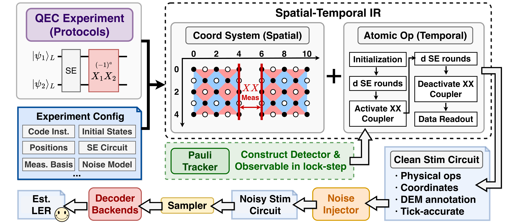

# LightStim — Getting Started

---

## Table of Contents

1. [Introduction](#1-introduction)
2. [Installation & Setup](#2-installation--setup)
3. [Quick Start](#3-quick-start)
4. [Core Concepts](#4-core-concepts)
5. [Going Further](#5-going-further)

---

## 1. Introduction

**LightStim** is a modular Quantum Error Correction (QEC) simulator built on top of
[Stim](https://github.com/quantumlib/Stim), Google's fast stabilizer circuit simulator developed by Craig Gidney.
LightStim provides a high-level framework for constructing, simulating, and analyzing QEC
experiments while Stim handles the low-level circuit simulation.

### What Stim provides

Stim is a high-performance stabilizer circuit simulator that represents quantum circuits as
sequences of Clifford gates, measurements, resets, and noise channels. It can sample detector
outcomes at millions of shots per second and produce detector error models for decoding.

### What LightStim adds

- **Automated detector generation** via Pauli tableau tracking — no manual detector annotation required
- **Multi-patch system management** with automatic local-to-global index mapping and coordinate transforms
- **Pluggable QEC codes**: Rotated Surface Code, Unrotated Surface Code, Toric Code, Repetition Code, BB codes, PQRM code
- **Protocol library**: Memory, Transversal CNOT, Lattice Surgery, GHZ, State Injection, Distillation, CrossLS
- **Standardized noise injection**: Code-capacity, phenomenological, circuit-level, biased noise models, and configurable noise models
- **Unified decoder backend**: PyMatching, BP+OSD (CPU/GPU), and MWPF decoders

### Architecture



LightStim separates physics (integer qubit indices, Pauli stabilizer strings) from geometry
(float coordinates for visualization). `QECPatch.qubit_coords` is the single source of truth
for geometry; grid maps are derived from it at runtime.

---

## 2. Installation & Setup

### Prerequisites

- Python 3.9+
- pip

### Installation

```bash
# Clone the repository
git clone https://github.com/x8fangQ/LightStim.git
cd LightStim

# Create and activate virtual environment
python3 -m venv venv
source venv/bin/activate    # Linux/macOS
# venv\Scripts\activate     # Windows

# Install dependencies
pip install -r requirements.txt
```

### Jupyter kernel (for notebooks)

```bash
python -m ipykernel install --user --name=qec-simulator --display-name="QEC Simulator"
```

### Decoder packages

`requirements.txt` already includes CPU decoder dependencies (`stimbposd`, `mwpf`, `frozendict`, `frozenlist`).

Install extra decoder packages only when needed:

```bash
pip install pymatching  # MWPM decoder (recommended if not already installed)
pip install cudaq_qec   # BP+OSD GPU decoder (NVIDIA only)
```

> **Always use `venv/bin/python`**, not the system Python. The GPU decoder (`cudaq_qec`) is
> only installed inside the venv; using system Python silently disables it and produces garbage
> LER results.

---

## 3. Quick Start

Build a distance-3 rotated surface code memory experiment, sample it, and verify noiseless
correctness.

```python
import sys, os
sys.path.insert(0, ".")

import numpy as np
from lightstim.protocols.memory import MemoryExperiment
from lightstim.qec_code.surface_code.rotated import (
    RotatedSurfaceCode,
    RotatedSurfaceCodeExtractionBlock,
)

# 1. Create a distance-3 rotated surface code patch
code = RotatedSurfaceCode(distance=3)

# 2. Build a Z-memory experiment (3 rounds, no noise)
experiment = MemoryExperiment(
    qec_system=code,
    extraction_block_class=RotatedSurfaceCodeExtractionBlock,
    rounds=3,
    noise_params=None,   # noiseless
    basis="Z",
)
circuit = experiment.build()

# 3. Verify: noiseless circuit should have zero detector and observable flips
sampler = circuit.compile_detector_sampler()
dets, obs = sampler.sample(shots=1000, separate_observables=True)

assert np.all(dets == 0), "Detector flips found in noiseless circuit!"
assert np.all(obs == 0),  "Logical errors found in noiseless circuit!"
print(f"Verification passed: {circuit.num_detectors} detectors, "
      f"{circuit.num_observables} observables, 1000 shots all clean.")
```

### Adding noise and decoding

```python
from lightstim.noise.config import NoiseConfig
from lightstim.simulation.decoder_backend.pipeline import SimulationPipeline
from lightstim.simulation.decoder_backend.config import DecoderConfig

# Build a noisy circuit
experiment = MemoryExperiment(
    qec_system=RotatedSurfaceCode(distance=3),
    extraction_block_class=RotatedSurfaceCodeExtractionBlock,
    rounds=3,
    noise_params=NoiseConfig(p_1q=0.001, p_2q=0.005, p_meas=0.001),
    noise_model="circuit_level",
    basis="Z",
)
noisy_circuit = experiment.build()

# Decode with PyMatching
pipeline = SimulationPipeline(
    decoder_config=DecoderConfig("pymatching"),
    max_shots=100_000,
    max_errors=100,
    num_workers=4,
)
stats = pipeline.run(noisy_circuit, json_metadata={"d": 3, "p": 0.001})
print(f"LER = {stats.logical_error_rate:.2e} "
      f"({stats.errors} errors / {stats.post_selected_shots} shots)")
```

---

## 4. Core Concepts

A brief QEC primer for developers new to quantum error correction.

### QEC Patches

A **QEC patch** is a collection of physical qubits arranged in a 2D layout that together encode
one or more **logical qubits**. Each patch contains:

- **Data qubits**: Store the logical quantum information
- **Syndrome qubits** (ancillae): Measure stabilizers without disturbing the logical state
- **Stabilizers**: Multi-qubit Pauli operators (products of X, Y, Z on subsets of data qubits)
  that define the code space. Measuring them reveals errors without revealing the encoded data.
- **Logical operators**: Pauli operators that act on the encoded logical qubit(s). They commute
  with all stabilizers but are not themselves stabilizers.

### Syndrome Extraction Rounds

Each round of **syndrome extraction** (SE) measures all stabilizers once:

1. Reset syndrome qubits
2. Apply entangling gates (CNOTs) between syndrome and data qubits
3. Measure syndrome qubits

The measurement outcomes form a **syndrome**. Changes in the syndrome between consecutive
rounds signal errors.

### Noise Models

LightStim supports four noise models, each adding errors at different circuit locations:

| Model | Where noise is added |
|-------|---------------------|
| `code_capacity` | Pauli errors on data qubits only (before measurement) |
| `phenomenological` | Data qubit errors + measurement errors |
| `circuit_level` | After every gate, measurement, reset, and idle |
| `XZ_biased` | Circuit-level with asymmetric X/Z error rates |

### Detectors and Observables

- A **detector** is a parity check on measurement outcomes that should be deterministic in the
  absence of errors. When a detector fires, it signals an error occurred.
- A **logical observable** is a parity of measurements encoding the logical qubit state.
  Decoding errors cause observable flips, which correspond to logical errors.

LightStim generates detectors automatically using **Pauli tableau tracking**: as the circuit
evolves, the `SyndromeTracker` maintains a tableau of stabilizers and their measurement records,
emitting `DETECTOR` instructions whenever a stabilizer is re-measured. No manual annotation needed.

### Decoding

A **decoder** takes the syndrome (detector outcomes) and predicts which logical observables
were flipped by errors. The **logical error rate** (LER) is the fraction of shots where the
decoder's prediction disagrees with the actual observable.

---

## 5. Going Further

| I want to… | Where to look |
|---|---|
| Build a circuit for a custom protocol | [`skills/builder-tracker-api/`](../skills/builder-tracker-api/SKILL.md) |
| Design a new lattice surgery coupler | [`skills/logical-coupler-design/`](../skills/logical-coupler-design/SKILL.md) |
| Run a simulation and get LER | [`skills/simulate-decode/`](../skills/simulate-decode/SKILL.md) |
| Configure noise models | [`skills/custom-noise/`](../skills/custom-noise/SKILL.md) |
| Add a new QEC code | [`skills/extend-new-code/`](../skills/extend-new-code/SKILL.md) |
| Write or update a protocol notebook | [`skills/notebook-workflow/`](../skills/notebook-workflow/SKILL.md) |
| Debug unexpected detector counts or LER≈50% | [`skills/gotchas/`](../skills/gotchas/SKILL.md) |
| Precise API signatures for every class | [`docs/api/ir.md`](api/ir.md), [`docs/api/simulation.md`](api/simulation.md) |
| Reproduce paper figures | [`paper_artifact/README.md`](../paper_artifact/README.md) |
| Browse demo notebooks | [`notebooks/README.md`](../notebooks/README.md) |
